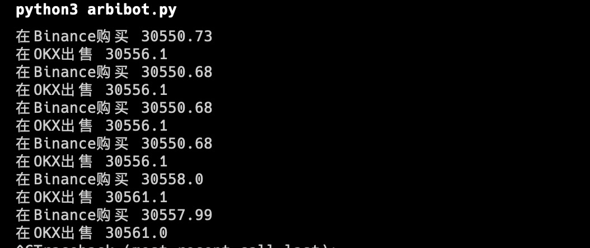
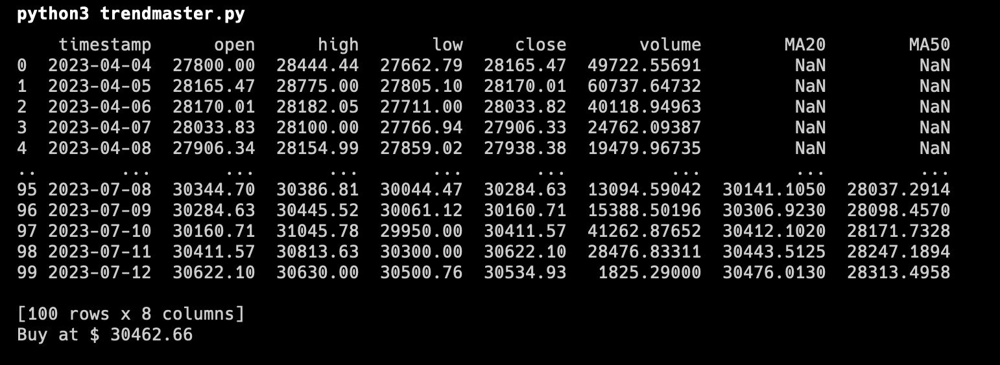
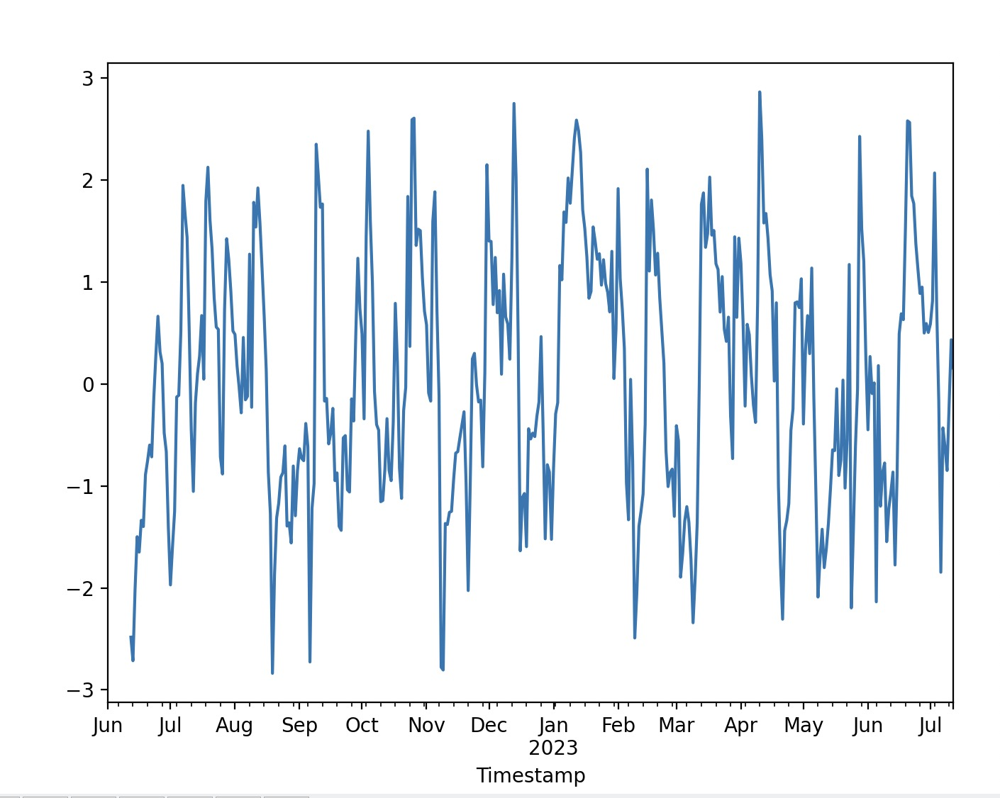
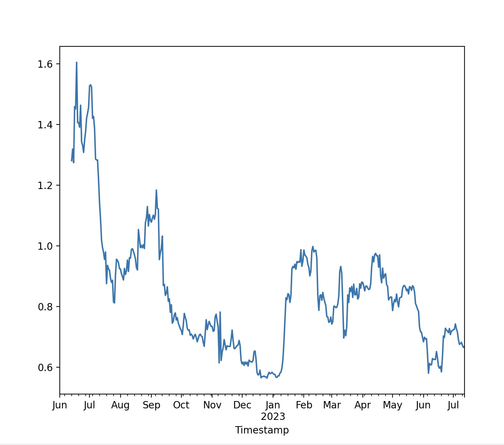

# Trading Try

## 尝试更多不同的量化方式

## tip：交易有风险 入市须谨慎

**量化交易**是使用数学模型和大数据进行决策的一种交易方式，旨在通过程序来执行交易，以便能更快速、更精确地执行交易，并降低人为错误。

以下列出各种不同的方式并用配套程序来实现各种交易策略：

__运行下面程序前，确保已安装所有依赖库__
``pip install -r requirements.txt``

## 套利

检测交易所或者流动池之间的价差并通过买入买入赚取价差，实现无风险收益

**实现思路**：

> - 1.**获取多个市场价差**，需要在多个交易平台上获取实时的价格信息
>
> - 2.**实时监控和比较价格差异**实时监控各个市场的价格，并比较同一种加密货币在不同市场的价格。当发现某个市场的价格低于其他市场时，可以在这个市场上买入，然后在价格高的市场上卖出。
>
> - 3.**执行套利交易**一旦发现套利机会，就需要立即执行交易，因为这种价格差异往往不会持续很长时间。需要注意的是，交易所之间的交易速度和费用可能会影响到套利的成效。
>
> - 4.**风险管理**虽然理论上套利策略是无风险的，但实际操作中可能会有各种风险，如交易所的延迟、破产等。因此，还需要有风险管理措施，比如分散投资在不同的交易所，避免单一交易所带来过大的风险。

``arbibot.py`` 为套利交易的简单例子，通过程序可以非常直观理解陶粒思想

进入到目录，输入：``python3 arbibot.py``即可运行：

## 趋势追踪

趋势追踪策略是识别和跟随市场趋势的一种策略。这种策略通常使用技术指标（如移动平均线或相对强弱指数）来识别市场的上升或下降趋势，然后据此买入或卖出。

**实现思路**：

> - 1.**选择合适的技术指标**：比如使用移动平均线，我们可以计算出短期和长期的移动平均线。当短期线从下方突破长期线，我们视为上升趋势；当短期线从上方下穿长期线，我们视为下降趋势。
>  
> - 2.**设置交易规则**：当确认了上升或下降趋势后，可以设置交易规则。例如，如果是上升趋势，可以设置买入规则；如果是下降趋势，可以设置卖出规则。
>  
> - 3.**程序化交易**：将这些规则编码成算法，一旦触发了买入或卖出的条件，算法就会自动执行交易。

``trendmaster.py`` 为套利交易的简单例子，通过程序可以非常直观理解陶粒思想

进入到目录，输入：``python3 trendmaster.py``即可运行：

## 均值回归

均值回归策略假设价格将趋向于其历史平均值。当价格偏离其均值时，交易者会预期价格将返回均值，因此买入或卖出。

**实现思路**：

> - 1.**计算历史平均价格**：根据过去一段时间的价格数据，计算出平均价格。
>
> - 2.**设定阈值**：确定价格偏离平均价的阈值，当价格超过这个阈值时，视为价格偏离了平均值。
>
> - 3.**编写交易规则**：当价格超过阈值并向上偏离时，预期价格会下跌，因此卖出；当价格低于阈值并向下偏离时，预期价格会上涨，因此买入。
>
> - 4.**自动化交易**：将这些规则编写成程序，当价格达到买入或卖出条件时，程序自动执行交易

## 高频交易

高频交易是一种利用计算机算法进行大量、快速交易的策略，旨在从非常小的价格变动中获利。

``mean_reversion.py`` 为套利交易的简单例子，通过程序可以非常直观理解陶粒思想

进入到目录，输入：``python3 mean_reversion.py``即可运行：

**实现思路**：

> - 1.**获取高速数据源和交易接口**：高频交易依赖于快速的数据源和交易接口，以保证能够快速获取到市场数据并执行交易。
>
> - 2.**设计高频交易策略**：高频交易策略可以非常复杂，一般会涉及大量的统计分析和模型预测。其中一种常见的策略是市场挂单策略，即在订单深度表的买卖两侧同时挂单，当市场价格波动时获利。
>
> - 3.**编写并优化交易算法**：将策略编写成算法，并通过不断的测试和优化，以提高交易的成功率和收益。
>
> - 4.**管理风险**：尽管高频交易可以带来高收益，但同时也存在高风险。因此，需要有严格的风险管理措施，如设置止损点，避免单一交易带来过大的损失。

## 机器学习

使用各种数据，包括价格数据、市场情绪数据、宏观经济数据等，然后通过机器学习模型来预测价格。

**实现思路**：

> - 1.**数据获取和预处理**：获取所需的各种数据，并进行预处理，如清洗、标准化等。
>
> - 2.**选择和训练模型**：选择合适的机器学习模型，如线性回归、决策树、神经网络等。然后使用历史数据来训练这个模型。
>
> - 3.**预测并执行交易**：使用训练好的模型来预测未来的价格变动，然后据此执行交易。比如，如果模型预测价格会上涨，那么可以买入；如果预测价格会下跌，那么可以卖出。
>
> - 4.**评估和优化**：通过回测来评估策略的效果，并根据结果来优化模型和调整策略。

